# NIMO Example
このレポジトリでは、ある物質Xの相図を作成する想定でNIMOの使い方を説明します。

物質Xは以下のような相図を持ちます。


- 三重点 (0 ℃, 5000 Pa) を通る直線より下の領域は気体
- 直線よりも上の領域で0℃未満では固体、0℃以上では液体

## IvoryOSインターフェースの使用例
### インストール
IvoryOSを使う場合は追加のインストールが必要です。

```
pip install ivoryos
```

動作確認はNIMO v2.1.2, IvoryOS v1.5.13で行いました。

### インターフェースの起動
エディターを起動して、以下のPythonプログラムを入力し`main.py`という名前で保存してください。

```python
import ivoryos


# SDLクラスの定義
class SampleSDL:   
    def __init__(self):
        # 相図パラメータの定義
        self.t_triple = 0
        self.p_triple = 5000
        self.slope = 50
        
    def get_phase(self, temperature: float, pressure: float) -> int:
        """
        指定された温度・圧力に対応する相を求める
        0: 固相, 1: 液相, 2: 気相
        """
        boundary = self.slope * (temperature - self.t_triple) + self.p_triple
        
        if pressure < boundary:
            return 2
        else:
            if temperature < self.t_triple:
                return 0
            else:
                return 1


if __name__ == "__main__":
    # SDLクラスインスタンスの作成
    sdl = SampleSDL()

    # IvoryOSインターフェースの起動
    ivoryos.run(__name__, port=8888)
```

保存したPythonプログラムを実行して、IvoryOSインターフェースを起動してください。

```
python main.py
```

### ワークフローの設計
これを実行したまま、Webブラウザーで `http://127.0.0.1:8888/` にアクセスすると以下のような画面が開きます。

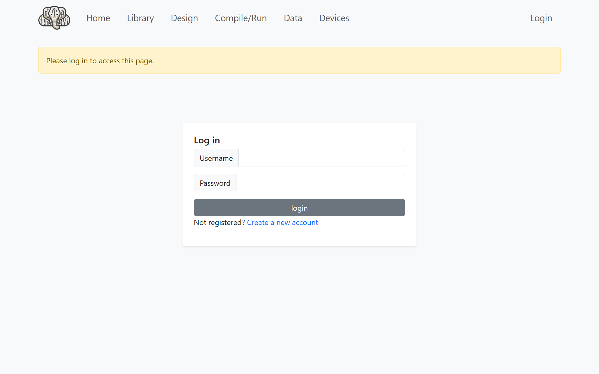

`Create a new account`をクリックして、ユーザー名とパスワードを設定してください。

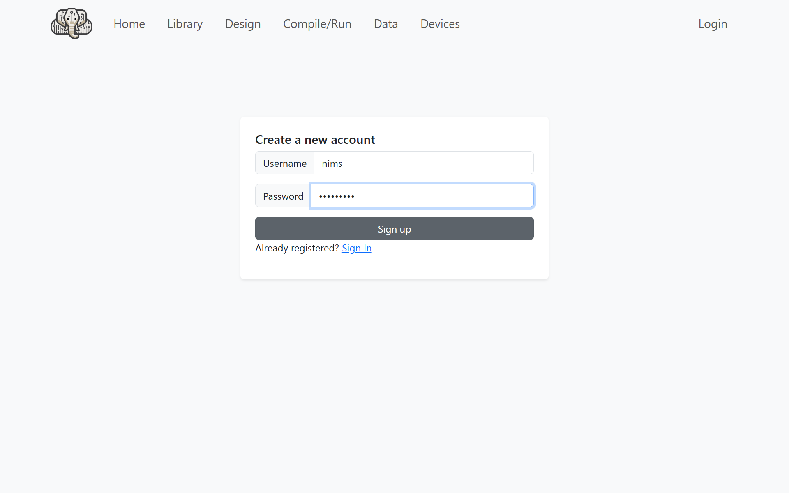

設定したユーザー名とパスワードを入力してログインしてください。

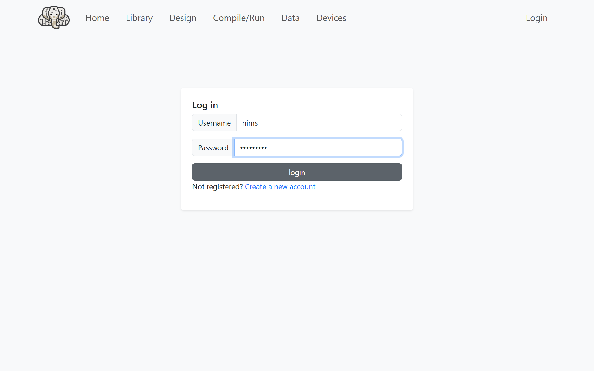

ログインすると次のようなメニュー画面が開きます。

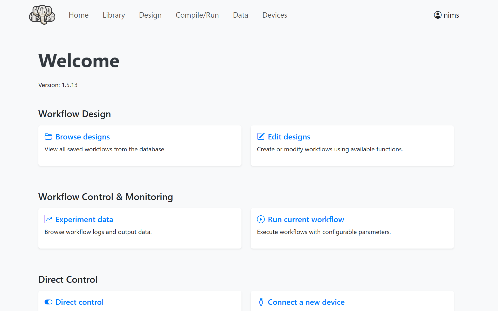

右上の`Edit designs`をクリックすると次のようなワークフロー編集画面が開きます。

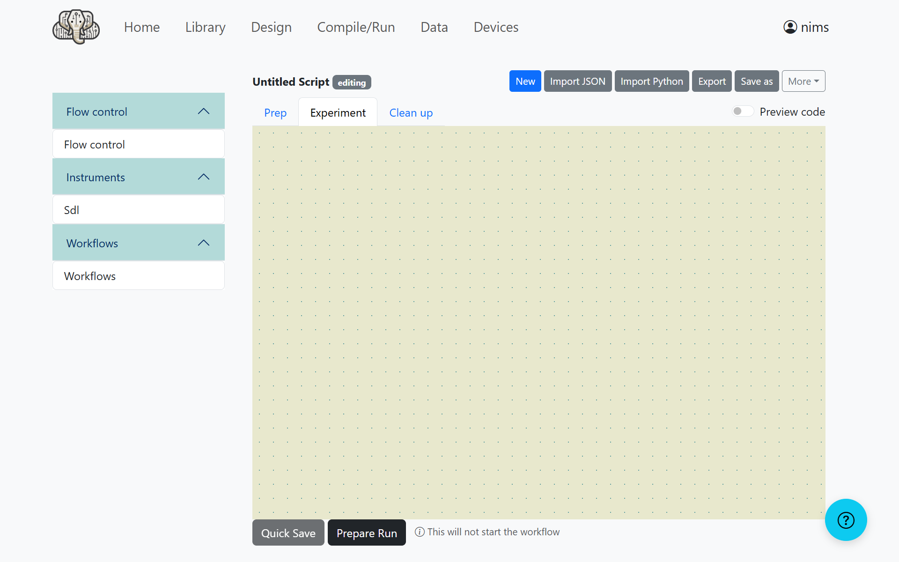

`Instruments`の下の`Sdl`をクリックして、次のように入力します。
- Temperature: `#temperature`
- Pressure: `#pressure`
- Run once per batch: チェックしない
- Save value as: `objective`

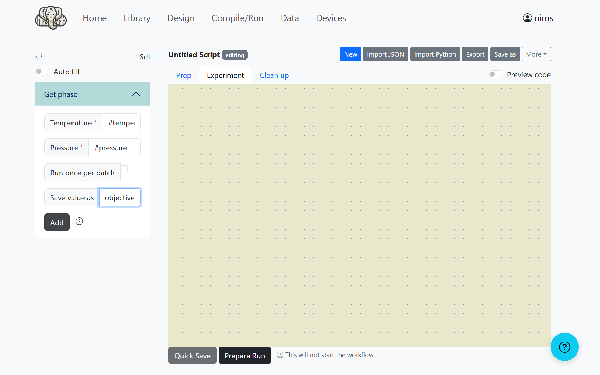

`Add`ボタンをクリックすると、ブロックが追加されます。

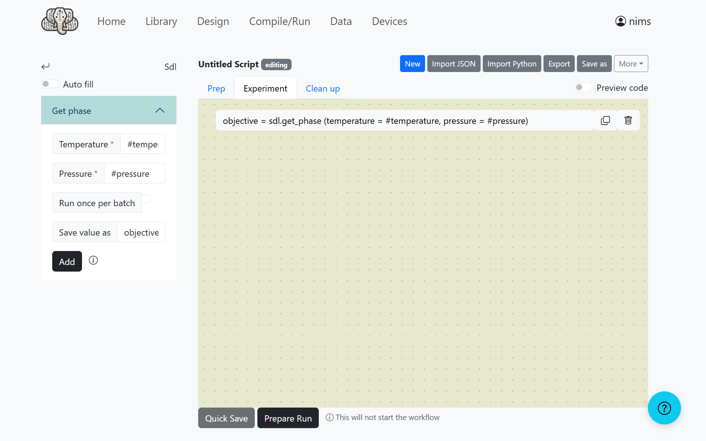

このようにブロックを組み合わせることでワークフローを設計できます。

# 実験計画の実行
ワークフローの設計が終わったら、`Prepare Run`ボタンをクリックして実験計画の設定画面を開きます。
以下のように数値を設定してください。

- Optimizer Strategy: `nimo`
- temperature: `-50` (Min), `150` (Max), `10` (Step) 
- pressure: `0` (Min), `20000` (Max), `1000` (Step)
- Max Iterations: `40`

その他の設定は変更する必要がありません。

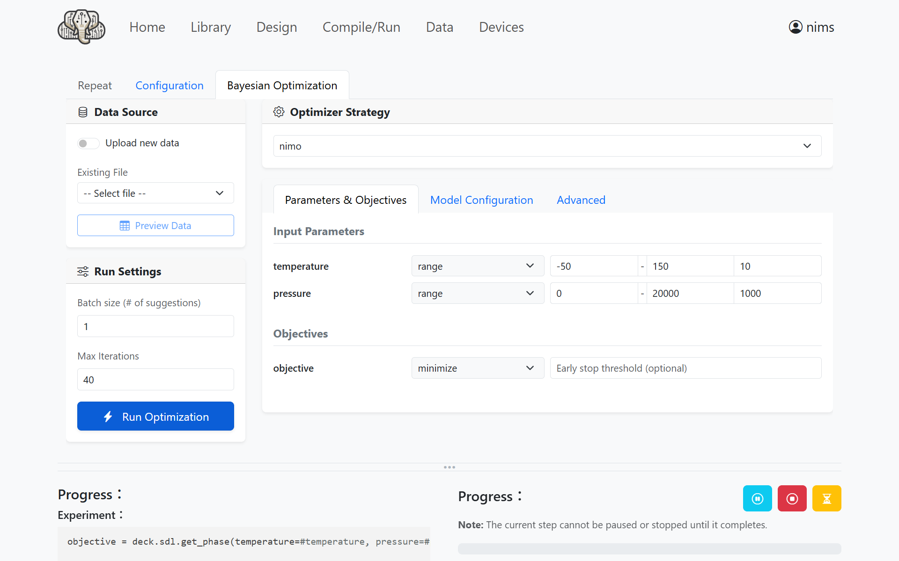

`Model Configuration`を開いて、次のように設定してください。

- Surrogate Model: `RE`
- Num Samples: `10`
- Acquisition Function: `PDC`

この設定では最初の10回はランダム探索を行い、その後はPDCアルゴリズムによる探索を行います。

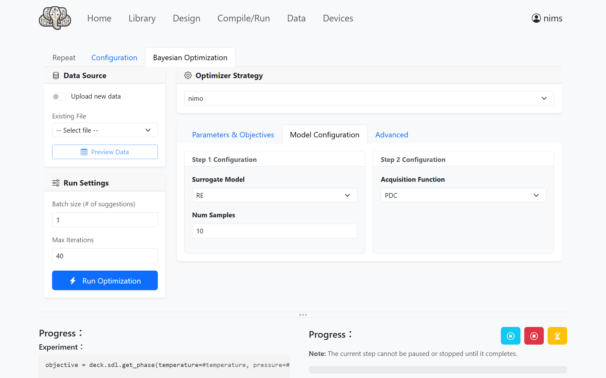

### 実験の実行
`Run Optimization`ボタンをクリックすると、NIMOによる実験がスタートします。


少し待っていると実験が終了します。

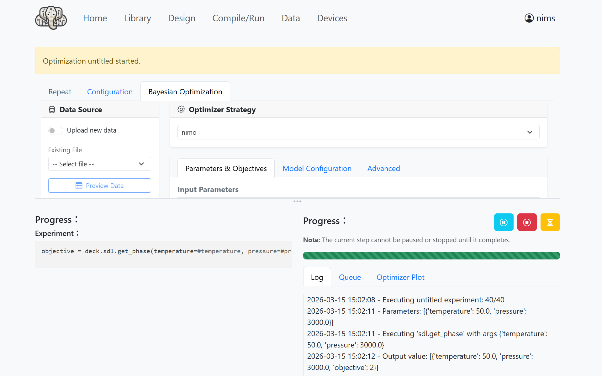

`Optimizer Plot`を開き、`Reflesh Plot`をクリックすると作成された相図が表示されます。
ランダム探索の結果によっては異なる相図が表示される場合があります。

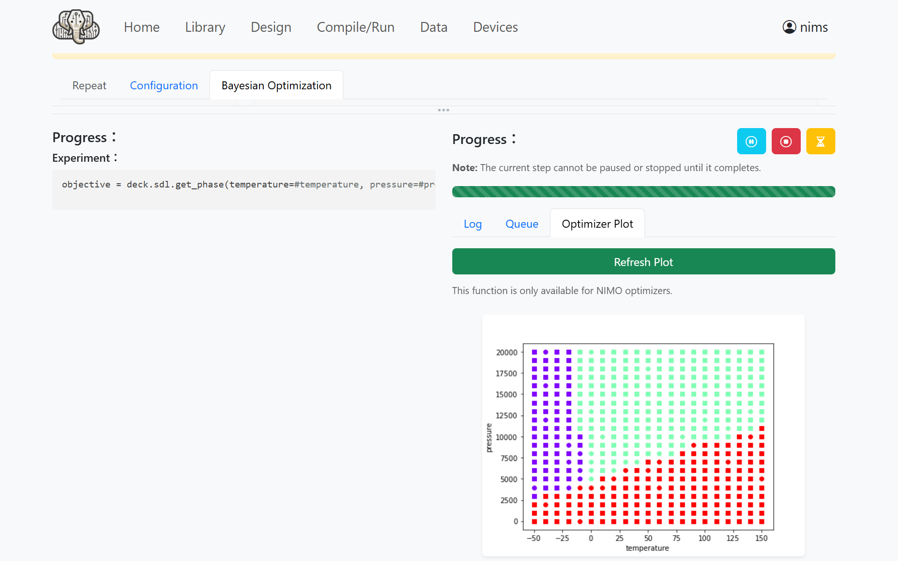

### （発展）予備実験結果の入力
既に予備実験の結果がある場合は、実験計画設定画面の左上にあるData SourceのUpload new dataを有効にして、予備実験の結果を入力した以下のような[CSVファイル](./data/preliminary_results.csv) をアップロードすることができます。CSVの列名はワークフロー設計画面で入力した変数名と一致させる必要があります。
```
temperature,pressure,objective
-50,0,2
-50,20000,0
150,20000,1
```

### 既知の問題点
- 一度実験を行った画面で再度実験を実行して相図を表示するとIvoryOSが落ちることがあります。IvoryOSを再起動することで問題は解決するようですが、原因は調査中です。