# NIMO Example
このレポジトリでは、ある物質Xの相図を作成する想定でNIMOの使い方を説明します。

物質Xは以下のような相図を持ちます。
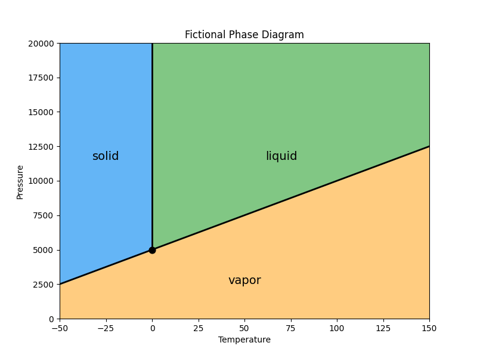

## ライブラリのインストール
pipを使ってNIMOをインストールします。

```
pip install nimo
```

## Pythonを自分で書く場合
Pythonを自分で書く場合のサンプルが `main_plain.py` で提供されています。
細かい挙動を自分で指定したい場合はこちらを参考にしてください。

## IvoryOSを使う場合
### インストール
IvoryOSを使う場合は追加のインストールが必要です。

```
pip install ivoryos
```

### インターフェースの起動
以下のコマンドでIvoryOSインターフェースを起動できます。

```
python main.py
```

これを実行したまま、Webブラウザーで `http://127.0.0.1:8888/` にアクセスすると以下のような画面が開きます。

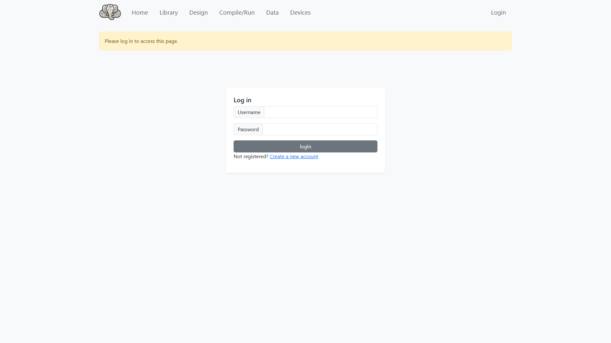

必要に応じてユーザーを作成し、ログインすると次のようなメニュー画面が開きます。

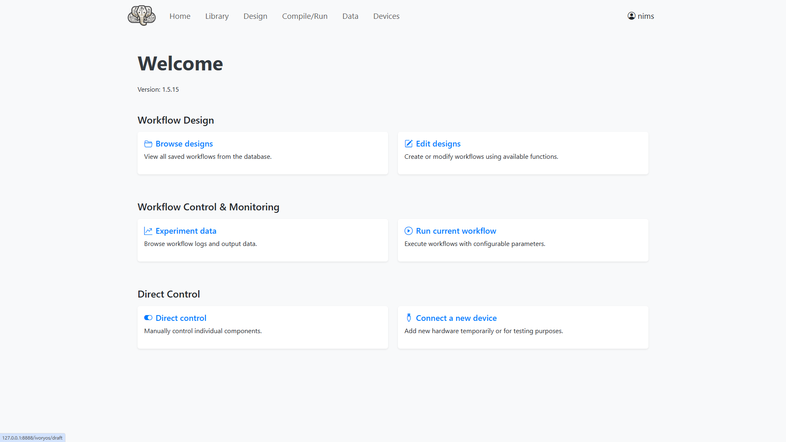

右上のEdit designsをクリックすると次のようなワークフロー編集画面が開きます。

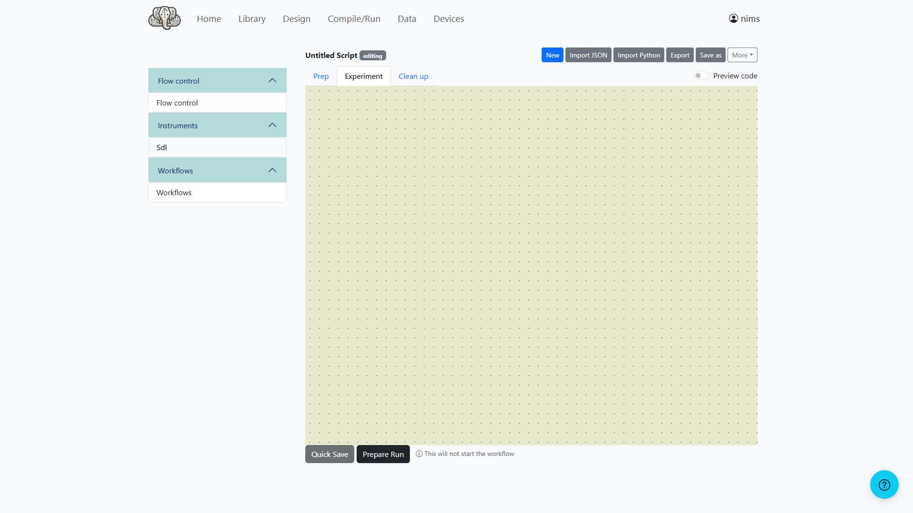

Instrumentsの下のSdlを開いて、次のように入力します（タイポがあるので後で直す）。

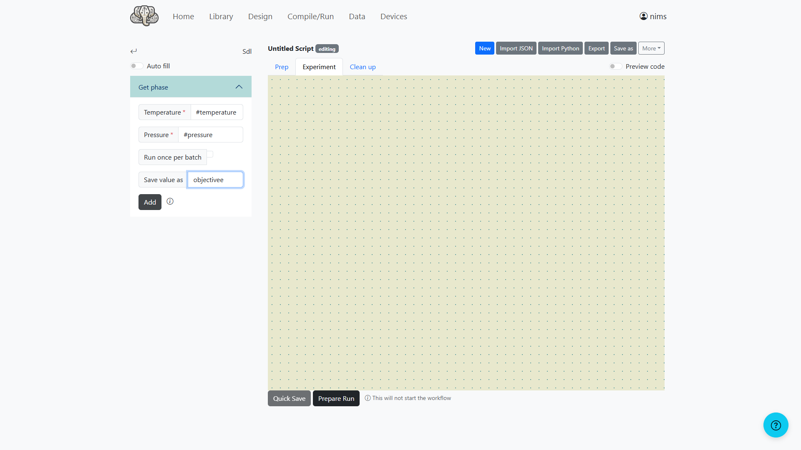

Addボタンをクリックすると、ブロックが追加されます。

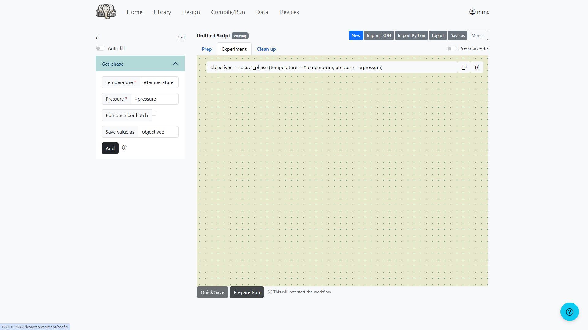

Prepare Runボタンをクリックすると、最適化の設定画面が開きます。以下のように数値を設定してください。
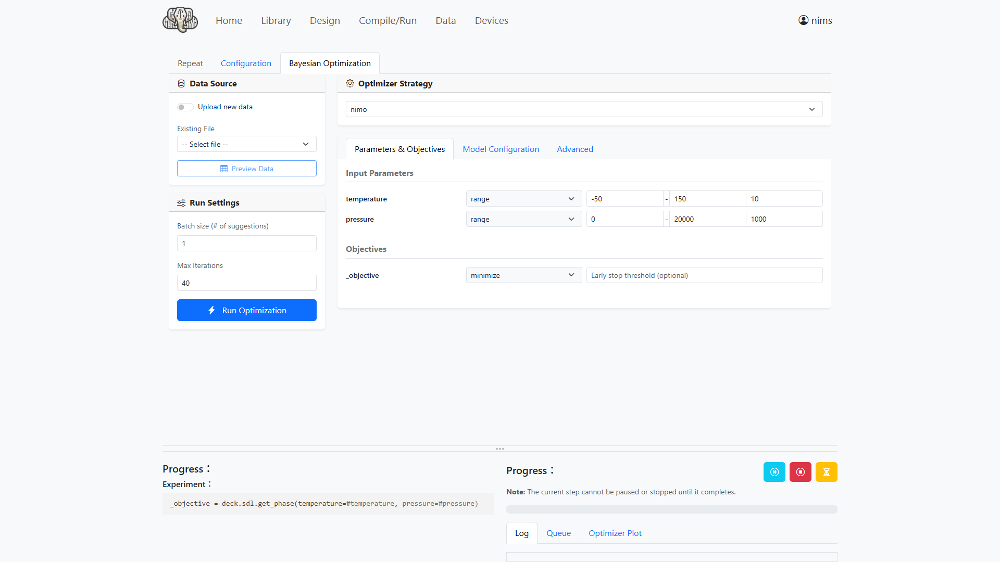

Model Configurationを開いて、次のように設定してください。

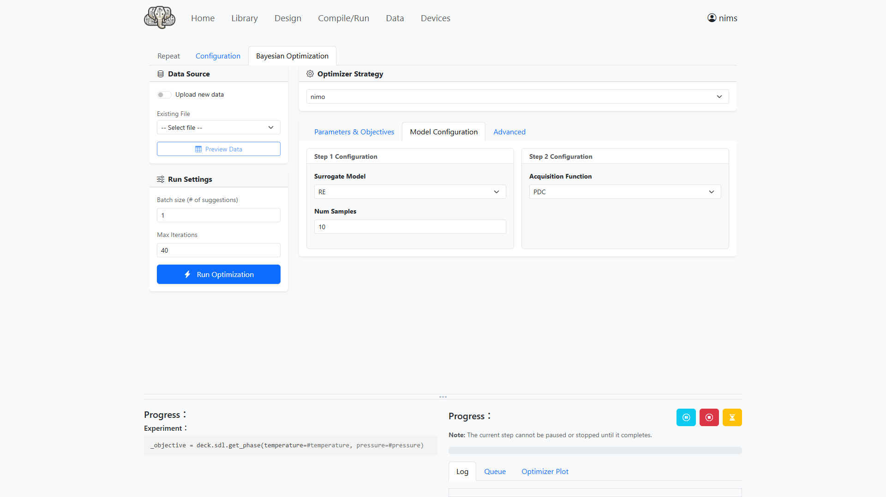

Run Optimizationボタンをクリックすると、NIMOによる実験がスタートします。

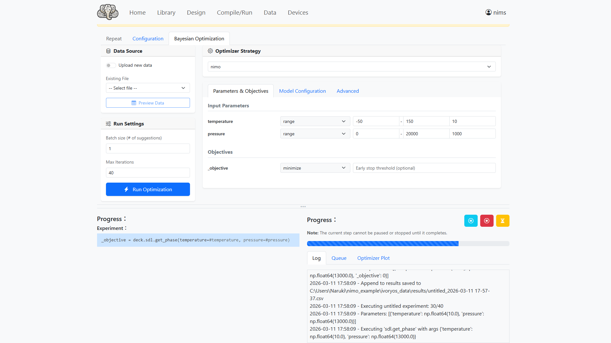

しばらく待っていると実験が終了します。

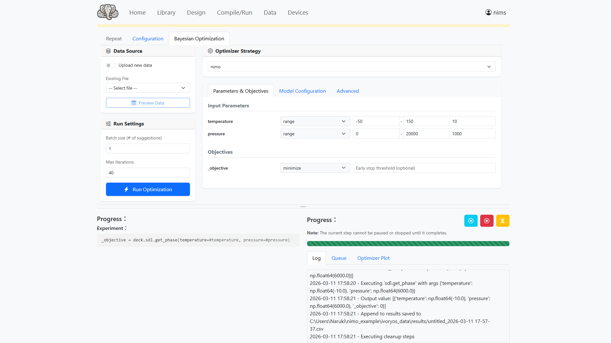

Optimizer Plotを開き、Reflesh Plotをクリックすると作成された相図が表示されます。

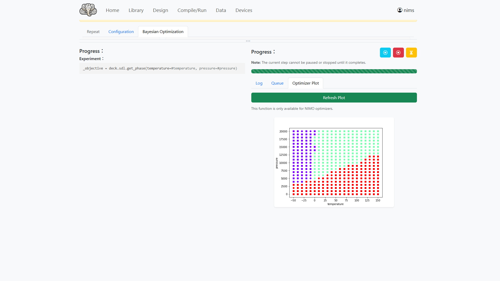